#Nuance Sample App

##简介：
Nuance公司（Nuance Communications, Inc. (NASDAQ: NUAN)) 是最大的专门从事语音识别软件、图像处理软件及输入法软件研发、销售的公司。

开发者主页：http://developers.nuance.com
# Setup

Note: This project was created for use in Android Studio.

## Using SpeechKit as an AAR

We are compiling against API level 23, so make sure you have it installed.

* Open this directory in Android Studio.
* Copy SpeechKit.aar into `./app/aars`

## Using SpeechKit as a library project

If you are developing both this app and SpeechKit, you may want SpeechKit to be a library project.

Add the following to the dependencies block in the apps build.gradle file:

``` java
    compile (project(':speechkit')) {
        transitive false
    }
```

Add the following to your settings.gradle file:
``` java
    include ':speechkit'
    project(':speechkit').projectDir = new File(settingsDir, '<relative path to speechkit module>')
```


###①.注册
进入开发者首页后点击右上角注册账号（注意密码设置至少8位，有大小写字母数字）：
&emsp;&emsp;&emsp;&emsp;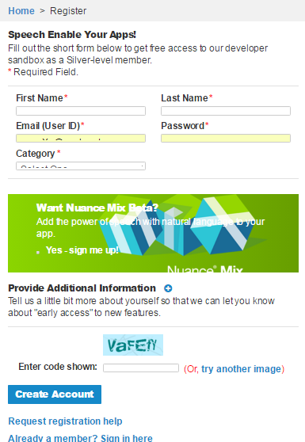
    
注册完成之后登陆，需要你激活邮箱，按照步骤做就行。


###②.预览
激活登陆之后点击Docs&SDKs：
&emsp;&emsp;&emsp;&emsp;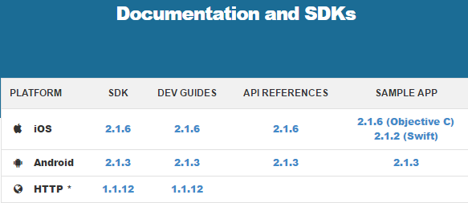
先看看开发指栏（DEV GUIDES），选择对应平台，这里我们选Android的，现在版本为2.1.3.
&emsp;&emsp;&emsp;&emsp;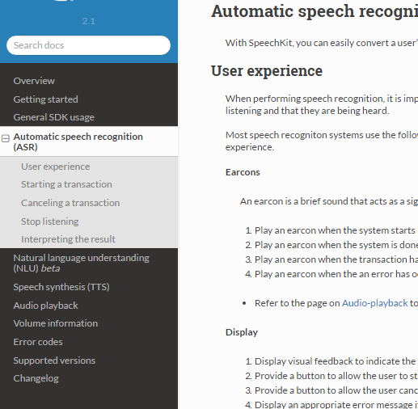
左边菜单栏有各种功能，我们现在选择自动语音识别ASR技术，右边就会有一些快速入门的示例。

###③.下载sample app
最简单粗暴的学习方法就是看Demo，Nuance提供了Sample app，直接下载：
&emsp;&emsp;&emsp;&emsp;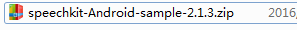
这是一个Stutio工程，直接打开，包结构：
&emsp;&emsp;&emsp;&emsp;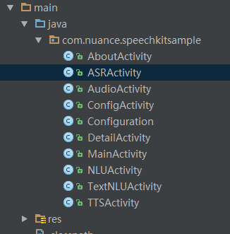

代码非常少而且简单易读，而我们用的ASR一眼就知道该看那个Activity。

运行之后点击第一条：Speech Recognition，然后程序就蹦了，原因是没有填写App Key 和App ID等配置信息
&emsp;&emsp;&emsp;&emsp;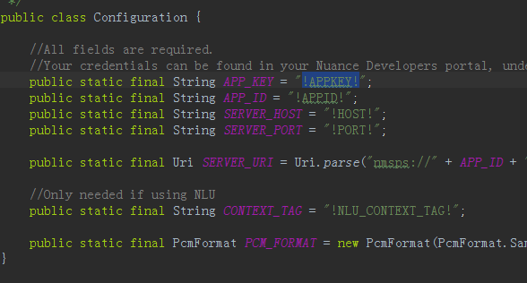

###④.申请KEY ID
点击My Account->左下方有一个Create New App，下面的步骤就略过了，填写信息一路Continue:
&emsp;&emsp;&emsp;&emsp;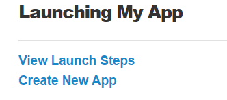
创建完毕之后，需要到My Account->点击刚刚创建的app：
&emsp;&emsp;&emsp;&emsp;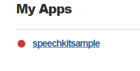
获取创建的app的keyid等信息：
&emsp;&emsp;&emsp;&emsp;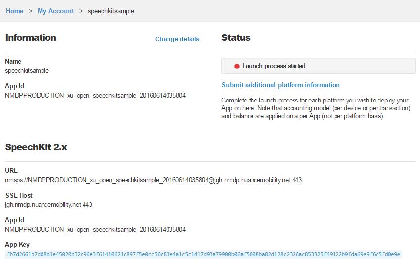
将对应的信息配置到Configuration中：
&emsp;&emsp;&emsp;&emsp;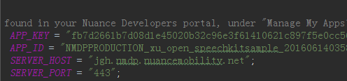

然后。。。就能正常使用了：
&emsp;&emsp;&emsp;&emsp;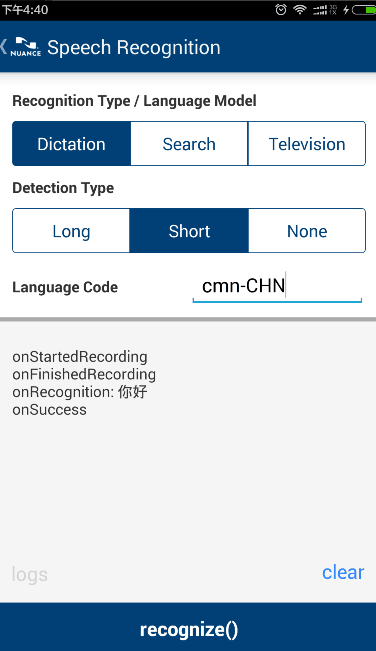

###⑤.设置语言
demo中Language Code那一栏填写的是你需要识别的语言代码，
比如上面我说中文，要识别为汉字，我们就填写cmn-CHN，代表普通话简体。其他支持的语言可以参考文档：
&emsp;&emsp;&emsp;&emsp;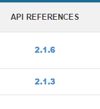
打开Language类：
&emsp;&emsp;&emsp;&emsp;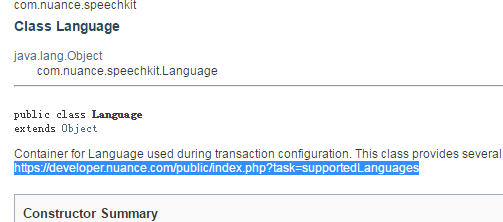
打开连接：https://developer.nuance.com/public/index.php?task=supportedLanguages
所有支持的语言都列出来了：
&emsp;&emsp;&emsp;&emsp;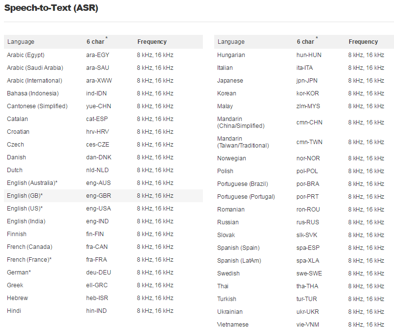

看不懂，百度翻译一下就OK：
&emsp;&emsp;&emsp;&emsp;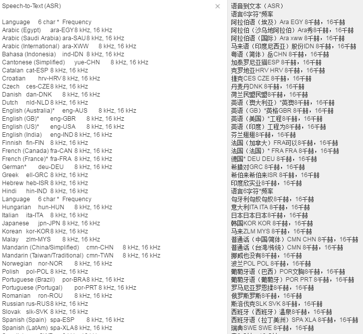